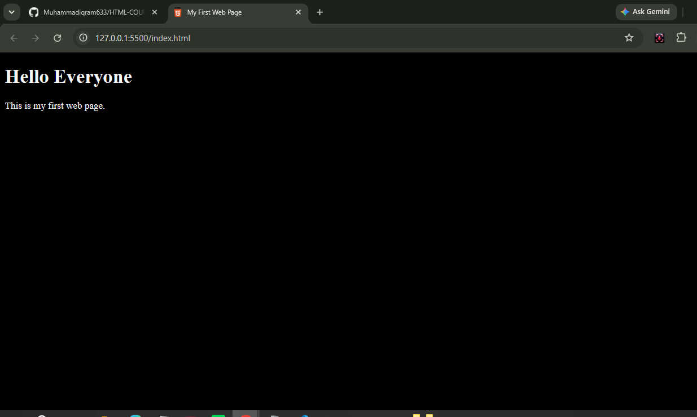
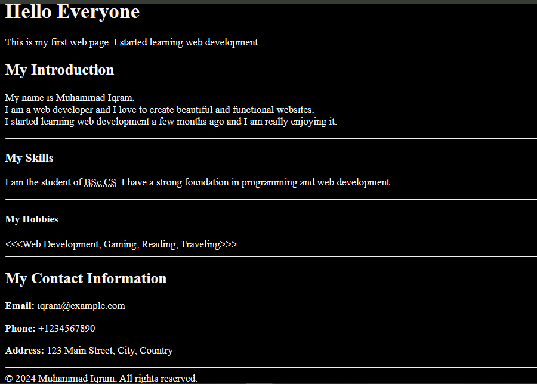
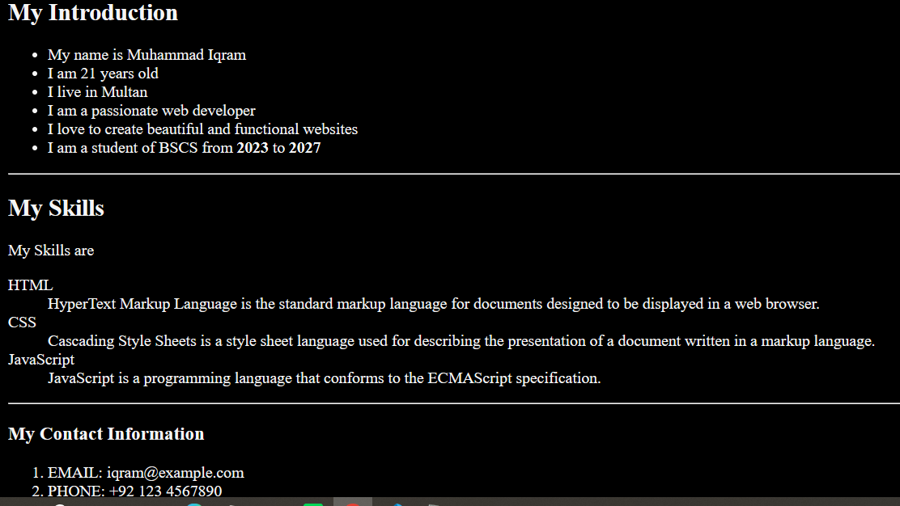
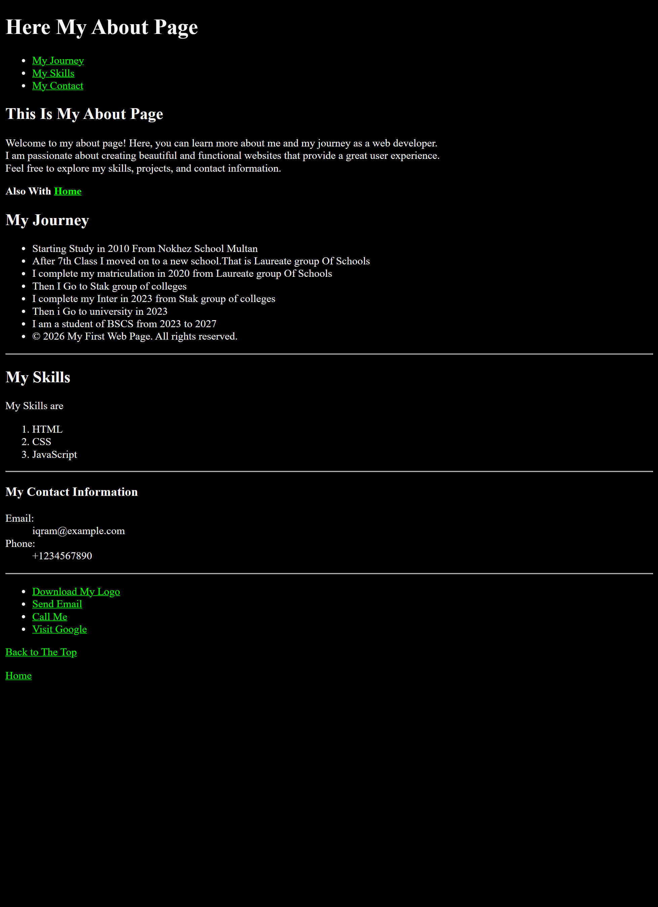
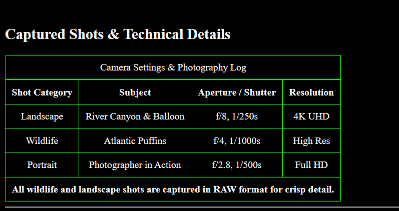
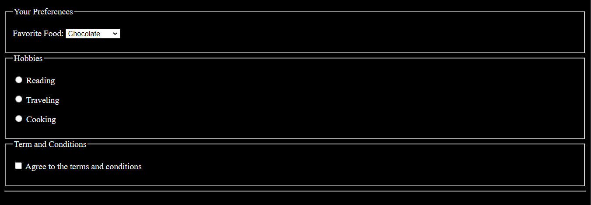

# HTML-COURSE-
HTML COURSE STARTING FROM (17-SEPTEMBER_2026).
I Complete this very fast because i have Basic Knowledge about that. so it take less time.

### 📌 Project Progress Log

| Day | Topics Covered | Preview Screenshot |
| :--- | :--- | :--- |
| **Day 01** | Basic HTML Structure, Headings (`<h1>`), Paragraphs (`
`), & Dark Mode CSS. |  |
| **Day 02** | HTML `<head>` Metadata, Meta Tags (`author`, `description`), Favicon Link, & External CSS Linking. |  |
| **Day 03** | Headings hierarchy (`<h2>`-`<h4>`), Line Breaks (` `), Dividers (`
`), Abbreviations (`<abbr>`), Strong text, & HTML Entities (`&copy;`, `&lt;`, `&gt;`). |  |
| **Day 04** | Unordered Lists (`<ul>`), Description Lists (`<dl>`, `<dt>`, `<dd>`), Ordered Lists (`<ol>`), & Bold Text (`<strong>`). |  |
| **Day 05** | Multi-Page Linking (`about.html`), Page Navigation (`<nav>`, Anchor IDs), Protocol Links (`mailto:`, `tel:`), Download Attribute, & Target Blank. |  |
| **Day 06** | Images & Media (``, `width`, `height`, `loading="lazy"`), Semantic Media (`<figure>`, `<figcaption>`), Image Download Links, & Multi-Page Portfolio. |   |
| **Day 07** | Semantic Layout (`<header>`, `<main>`, `<footer>`), Interactive Widgets (`
`, `
`), & Dedicated `contact.html` Page. |    |
| **Day 08** | HTML Tables Architecture (`<table>`, `<caption>`, `<thead>`, `<tbody>`, `<tfoot>`), Table Cells (`<th>`, `<td>`), & Camera Log Integration (`colspan`). |  |
| **Day 09** | HTML Forms (`<form>`, `<fieldset>`, `<legend>`), Input Controls (`radio`, `checkbox`), Dropdowns (`<select>`, `<optgroup>`), & Form Constraints. |   |
| **Day 10** | **The Little Taco Shop Project:** Multi-page restaurant site (`index.html`, `store.hour.html`, `contact.html`), Menu Pricing Table, Store Hours (`<dl>`, `<dt>`, `<dd>`), Contact Form, and semantic layout structure. |    |